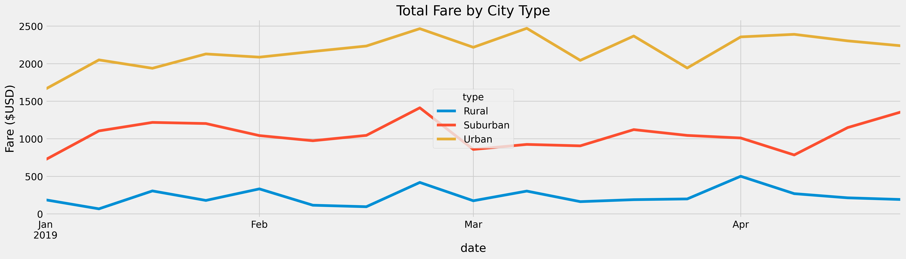

# PyBer_Analysis

Ride-sharing analysis

## Overview

The main purpose of this analysis is to reframe the data set about ride-hailing per city, using the Pandas method or approach to create a new index and data frames, to make it possible to get some insights about the activity by city types, that seems to correlate with the number of drivers and rides.

## Results

As is showed in the following table, Urban cities concentrate the volume in metrics, but on the other hand, the average fare is higher in suburban and rural cities, as there are fewer drivers than rides this push the prices up.

Figure i: Summary by city type.

As was pointed out before, urban cities concentrate the volume but there are almost 1.5 drivers per ride, this can indicate more offers than demand and it translates into fewer average fares. Meanwhile, the graph below illustrates that in the period from January to April, weekly rural fares maintain below 500 USD, suburban above 500 and below 1,500 and Urban over 1,500 and below 2,500. With some peaks in February.

Figure ii: Total Fare by City Type.

## Summary

There is an opportunity to use drivers in a more efficient way in urban cities since there are 1.5 drivers per ride, an analysis about demand peaks, and offers per hour could be a great way to deep-dive in this and make recommendations to grow demand rather than drivers.

Since in suburban cities, there are fewer drivers than rides and also in rural, there is an opportunity to review to increase driver offering and cross-boarder rides.
